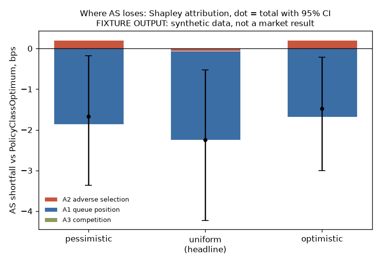

# M3: attribution pipeline (fixture run only)

**Status: machinery complete and exercised end to end on synthetic L3 data. No market-data attribution exists.** Two things block a real result: LOBSTER access from this environment, and an owner-committed pre-registration. Nothing below is a finding about Avellaneda-Stoikov in real markets.

## What the pipeline does

`asaudit ablate --config <toml> --workers N` (`src/asaudit/attribution/run.py`):

1. Per symbol, splits time-ordered episodes into calibration, policy fit and holdout. The holdout is never replayed.
2. Calibrates intensity, markouts, elasticity and the queue-fill logistic on the calibration span only.
3. Runs AS and the symmetric benchmark on every policy-fit episode, in all 8 grid cells, under each cancel-attribution policy.
4. Fits PolicyClassOptimum by expanding-window walk-forward for every cell and policy, with separable CMA-ES. Only out-of-sample episodes enter the gap.
5. Computes `gap_bps` per test episode, exact Shapley over the grid (efficiency asserted per episode), stationary block bootstrap CIs, bound intervals with sign-flip flags, per-symbol ranks and regime marginals. A2 is listed first.

Outputs do not depend on worker count (tested).

## Fixture run

Run `docs/evidence/m3-fixture/run`, clean commit 256b7c8, 5 synthetic symbols of 1,500 s each, 60 s episodes (10 calibration, 10 policy fit, 5 holdout per symbol), 35 out-of-sample episodes, 19.4 minutes on 4 cores.

**FIXTURE OUTPUT, synthetic data.** AS shortfall vs PolicyClassOptimum, bps (headline `uniform`, 95% CI):

| Axis | pessimistic | uniform | optimistic | Sign stable across bounds |
|---|---:|---:|---:|---|
| A2 adverse selection | +0.20 | -0.06 [-0.57, 0.34] | +0.21 | yes (a CI straddling zero is reported as such) |
| A1 queue position | -1.87 | -2.19 [-3.85, -0.73] | -1.69 | yes |
| A3 competition | 0.00 | +0.01 [-0.00, 0.02] | 0.00 | **no, no headline** |
| Total | -1.66 | -2.25 [-4.23, -0.53] | -1.48 | yes |

**Read this as a pipeline test, not a result.** The negative total says the fitted reference policy *lost* to AS. The cause is known: with the fixture budget of 30 evaluations, **0 of 560 walk-forward fits converged**, and the mean train-minus-test P&L gap is positive (in-sample overfitting). An under-optimised reference produces a meaningless gap. That is why `allow_unconverged` is `false` in `configs/ablation/lobster.toml`, where non-convergence fails the run (PRD 8). The fixture sets it `true` and records that in the manifest.

What the fixture does show about the machinery:

- A3 is near zero and flips sign across bounds, so the pipeline withholds its headline, as designed. This matches the fitted cancel elasticity (about 0.96), which leaves our depth almost no channel to other participants' cancels.
- Per-symbol ranks disagree across the 5 synthetic symbols (A1 ranks first in 3 of 5). On real data this is the stability check the pre-registration asks for.
- Pessimistic and optimistic bounds bracket the headline in both directions.

## Acceptance criteria

| PRD M3 criterion | Status |
|---|---|
| Shapley sums to the total gap, unit test | **Pass** (unit tests plus a per-episode assertion in the runner) |
| Signs and ranks stable across 5 symbols and 20 sessions | **Not assessable**: fixture only; the LOBSTER sample has 1 day per symbol, so "20 sessions" means 300 s episodes (78 per symbol) |
| Every headline has a bootstrap CI and a bound interval | **Pass** (fixture) |
| A2 computed and reported first | **Pass** |
| Primary stacked-bar figure legible without a caption | **Pass** (fixture); regime small multiples not yet drawn |

## Before the real run

1. The owner commits and tags `PREREGISTRATION.md` (draft in `docs/PREREGISTRATION.draft.md`).
2. Fetch LOBSTER, run `asaudit data validate` for all five symbols, then run the ablation.
3. Budget: `budget = 2000` with 16 cells x (78 x 0.3 - 3) folds per symbol is expensive. Measure one fold first, then choose the budget, and record why in DECISIONS.
